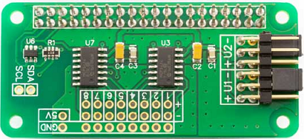
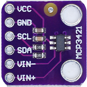

# node-red-contrib-iiot-rpi-mcp342x

[](https://nodered.org)
[](https://www.raspberrypi.com/)


[](https://www.paypal.com/cgi-bin/webscr?cmd=_s-xclick&hosted_button_id=ZDRCZBQFWV3A6)

A Node-Red node for mcp342x analog to digital converter<br>



Example  **MCP3424** hat from [AB Electronics UK](https://www.abelectronics.co.uk/)



Example **MCP3421** module

## Supported Devices
- **mcp3421** 1-channel, 12bit-18bit, one I2C address
- **mcp3422** 2-channel, 12bit-18bit, one I2C address
- **mcp3423** 2-channel, 12bit-18bit, eight I2C addresses
- **mcp3424** 4-channel, 12bit-18bit, eight I2C addresses
- **mcp3425** 1-channel, 12bit-16bit, one I2C address
- **mcp3426** 2-channel, 12bit-16bit, one I2C address
- **mcp3427** 2-channel, 12bit-16bit, eight I2C addresses
- **mcp3428** 4-channel, 12bit-16bit, eight I2C addresses

## Resolution and conversion time
- 12bit conversion time 5ms/channel
- 14bit conversion time 25ms/channel
- 16bit conversion time 100ms/channel
- 18bit conversion time 300ms/channel (mcp3421-mcp324)

## Installation
Install with Node-Red Palette Manager or npm command:
```
cd ~/.node-red
npm install node-red-contrib-iiot-rpi-mcp342x
```

## Usage
- This node works on Raspberry Pi with 32bit or 64bit OS.
- The output value is mV or adc raw data.
- For multi node, all values send as array.
- Set correct parameter depends on used device.
- Enable I2C with raspi-config.

## Array Index on Multi Node

|Input|Array-Index
|:----|:---:|
|CH1|0|
|CH2|1|
|CH3|2|
|CH4|3|

[CHANGELOG](CHANGELOG.md)<br>